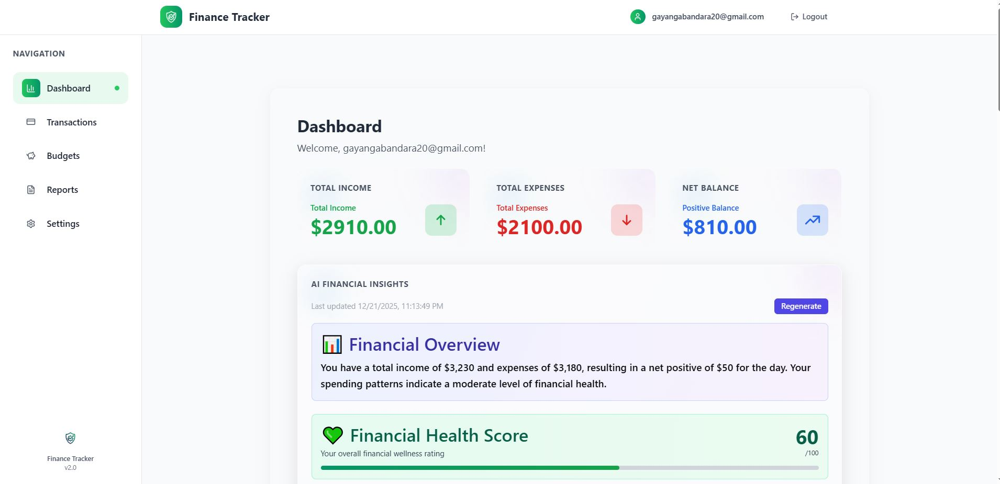

# Finance Tracker

A modern web application for tracking income, expenses, and budgets.


## Project Description

Finance Tracker is a responsive web application that helps users manage income, expenses, and monthly budgets through an intuitive dashboard. It exists to make personal finance management simpler and more visual, helping users build healthier spending habits.

## Features

- User registration & secure authentication (Supabase)
- Add, edit, and delete transactions (income & expenses)
- Category-based budgets and progress tracking with visual indicators
- Interactive charts and reports (line, bar, pie charts)
- AI-powered spending insights using LLM (Groq)
- Currency conversion and multi-currency display
- Export reports as PDF, Word, and JSON
- Date range filtering for reports (week, month, quarter, year)
- Budget analysis with progress bars and utilization percentages
- Financial summary statistics (income, expenses, net income)
- Category breakdown and monthly trend analysis
- Responsive UI with light/dark theme support
- Protected routes and error handling
- Form validation and notifications
- Lazy loading and skeleton states

## Tech Stack

- Frontend: React, React Router DOM, Vite, Tailwind CSS, Framer Motion
- Backend: Supabase (Postgres + Realtime)
- Charts: Chart.js, React Chartjs 2, Recharts
- Forms & Validation: React Hook Form, Yup
- Utilities: Axios, Date-fns, Lucide React
- Export: jsPDF, html2canvas, xlsx, docx
- AI: Groq (LLM) for AI Insights
- Tools: ESLint, Prettier, Vitest, TypeScript, Husky, lint-staged

## Screenshots



## Installation

1. Clone the repository

   ```bash
   git clone https://github.com/GayangaBandara/finance-tracker.git
   ```

2. Navigate to the project folder

   ```bash
   cd finance-tracker
   ```

3. Install dependencies

   ```bash
   npm install
   ```

4. Run the app
   ```bash
   npm run dev
   ```

## Environment Variables

Create a `.env.local` file and add:

```env
VITE_SUPABASE_URL=https://<your-project>.supabase.co
VITE_SUPABASE_ANON_KEY=sb_publishable_...
```

## Folder Structure

```
src/
├─ components/
├─ pages/
├─ services/
├─ context/
└─ App.jsx
```

## Usage

- Register or log in
- Add income and expenses
- View monthly analytics and charts
- Create budgets and monitor progress

## Future Improvements

- AI-based spending insights
- Export reports as PDF/CSV
- Multi-currency support and scheduled recurring transactions

## Contributing

Contributions are welcome. Please fork the repository and submit a pull request.

## License

This project is licensed under the MIT License.

## Author

Gayanga Bandara  
Software Engineering Undergraduate  
GitHub: https://github.com/GayangaBandara
